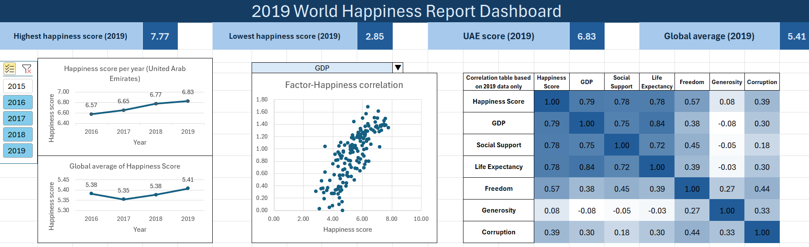
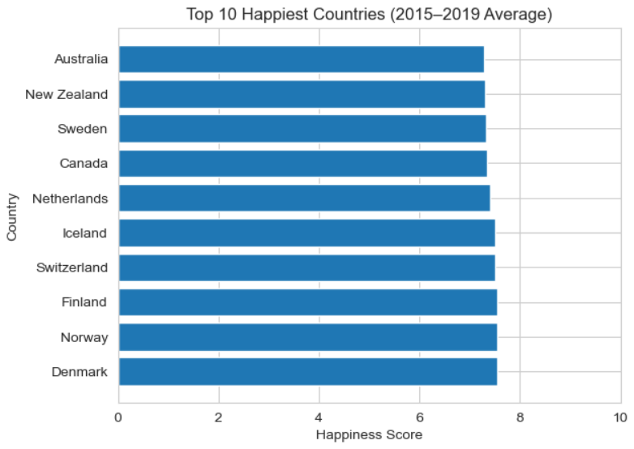
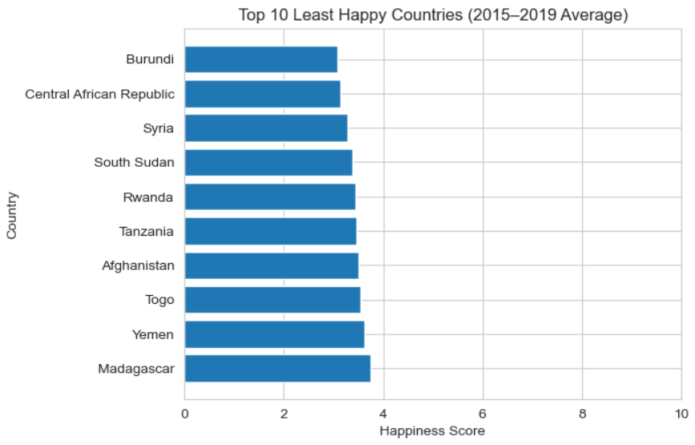
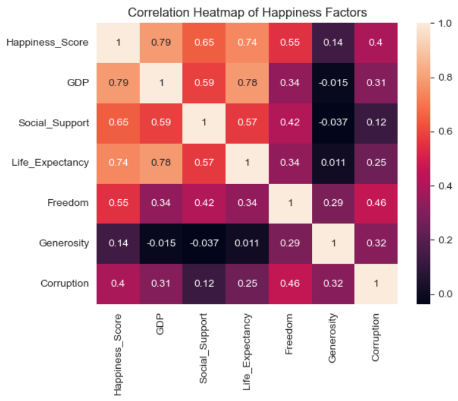

# world-happiness-analysis
Exploratory data analysis of the World Happiness Report (2015–2019) using Python, Pandas, SQL, matplotlib, and Seaborn. Analyses key drivers of national wellbeing (GDP, freedom, social support) with SQL querying and visualisations, including a regional spotlight on the UAE.

## Tools & Libraries
- **Python**: Pandas, NumPy, Matplotlib, Seaborn
- **SQL**: SQLite (in-memory querying for aggregation)
- **Excel**: interactive dashboard with pivot tables, slicers, and correlation table

## Files
- `World_Happiness_Report_Exploratory_Data_Analysis.ipynb` - main analysis notebook
- `happiness_clean.xlsx` - cleaned and combined dataset with an interactive dashboard

> Raw data sourced from the [World Happiness Report on Kaggle](https://www.kaggle.com/datasets/unsdsn/world-happiness).

## Dashboard Preview

## Contents
- **Data cleaning & standardisation**: merged 5 years of CSV files with inconsistent column naming into a single unified dataset
- **Top & bottom 10 happiest countries**: ranked by average happiness score across 2015–2019
- **UAE happiness trend**: tracked year-by-year score changes and contextualised dips against regional events
- **Correlation analysis**: heatmap and pair plots identifying which factors most strongly predict happiness
- **GDP vs Happiness**: regression plot exploring the relationship between wealth and wellbeing

## Key Questions Explored
- What factors predict national happiness most strongly?
- How has the UAE's happiness score changed over 5 years?
- How do GDP, social support, and life expectancy interact?
- Which countries are consistently the happiest and unhappiest?

## Key Findings

1. **GDP is the strongest predictor of happiness (r = 0.79)**: wealthier nations consistently score higher, but wealth alone doesn't tell the whole story.
2. **GDP, Life Expectancy, and Social Support form an interconnected cluster**: happiness is driven by systems working together, not any single factor.
3. **Generosity has almost no correlation with national happiness (r = 0.14)**: the least intuitive finding, altruistic nations are not necessarily happier ones.
4. **Freedom is a moderate but consistent predictor (r = 0.55)**: countries with greater personal freedom score meaningfully higher regardless of wealth.
5. **Corruption's positive correlation (r = 0.4) reflects reporting transparency**: wealthier, more open societies report corruption more visibly, creating a misleading positive relationship.

6. **The UAE maintained its position as one of the happiest nations in the Arab world through 2019**: The UAE saw a dip of 0.32 points in 2016 before recovering steadily through 2019. Notably, 2016 was the year the UAE established the world's first Ministry of Happiness, which was a landmark policy commitment to measuring and improving citizen wellbeing.

## How to Run
1. Clone the repository
2. To run the notebook, download the five yearly CSV files (2015–2019) from Kaggle and place them in a folder named `EDA_data/` in the same directory as the notebook.
3. Install dependencies: `pip install pandas numpy matplotlib seaborn`
4. Open the notebook: `jupyter notebook World_Happiness_Report_Exploratory_Data_Analysis.ipynb`
